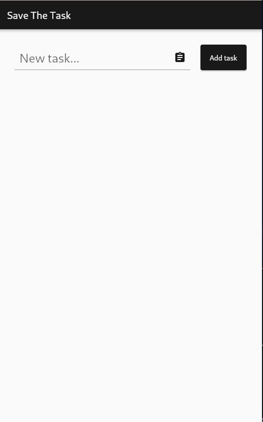
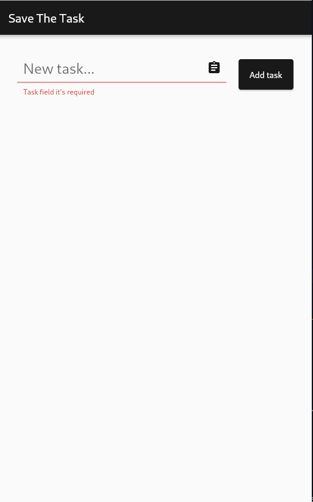
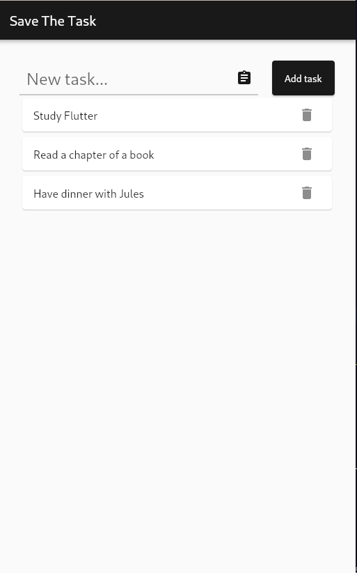
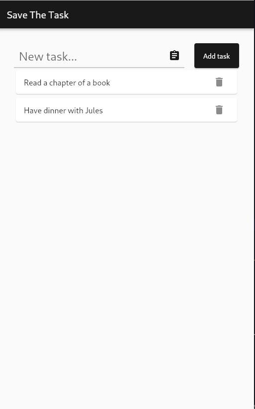

# Save the Task

A To-do list app in Flutter

## Goals

I started my journey studying Dart and Flutter recently and decided to practice some fundamental concepts by creating a simple app.
Along the way coding 'Save the Task' I could understand more about widgets, state management and styling.

## Further implementations

I intend to integrate the app with a database so the tasks won't get lost when the app is closed. I also want to implement a filter, a task complete button and categories when creating the tasks. 
I hope to build knowledge about Flutter and Dart to add these features soon.

## Screens

Home screen

Trying to add a task with text field empty

A few tasks

Deleting a task

